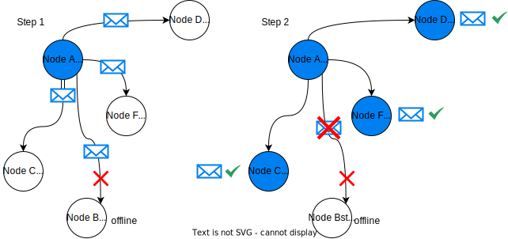
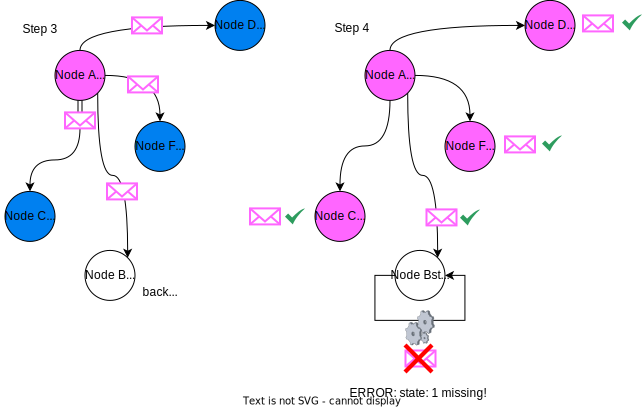
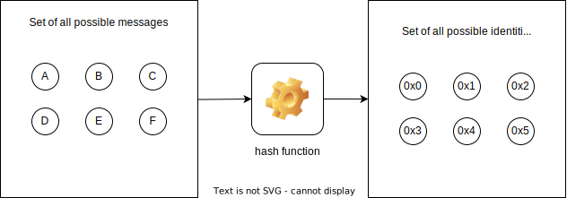
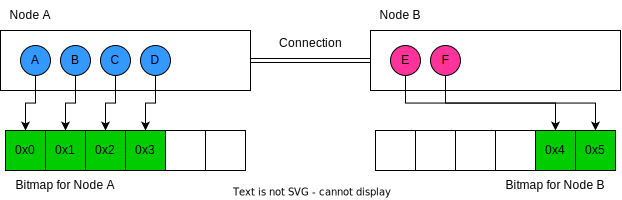
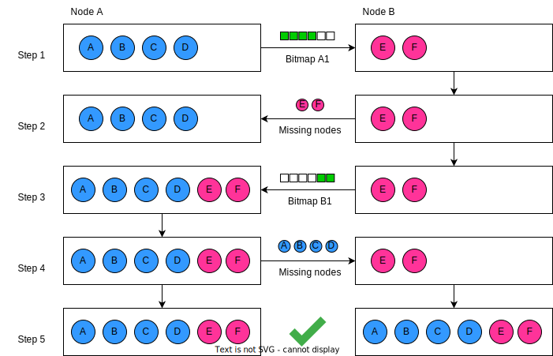
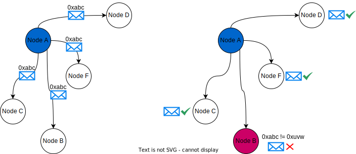
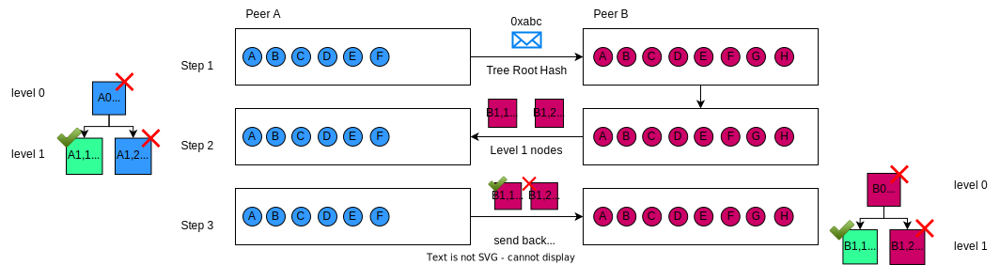
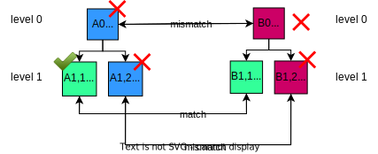

How Kiwi News Protocol works
============================

This document is a guide to understanding the Kiwi News Protocol.

Overview
--------

Kiwi News is built on an open, permissionless and decentralized peer to peer
protocol which facilitates:

- asynchronously verifiable distribution of all user-generated content using a `Patricia Merkle trie <https://ethereum.org/en/developers/docs/data-structures-and-encoding/patricia-merkle-trie/>`_.
- an NFT-based, sybil-resistant mechanism to let Ethereum addresses post and upvote content in the name of their ENS domain.

Decentralizing content using a PMT
__________________________________

Kiwi creates a total order over all user-generated messages. It sorts these messages into a Merkle Patricia trie. The trie's root is then gossiped to a p2p mesh network where two nodes with different root hashes start a synchronization process.

NFT-based sybil-resistance
__________________________

Kiwi News Protocol implements sybil-resistance by causing costs during a user's
sign-up. Technically, any user can send signed EIP-712 messages to a Kiwi node, however,
all messages are signed and a node will only consider messages valid where the message's signer is an Ethereum address who had previously minted the "Hyperkiwification" NFT at `eth:0xebb15487787cbf8ae2ffe1a6cca5a50e63003786 <https://etherscan.io/address/0xebb15487787cbf8ae2ffe1a6cca5a50e63003786>`_.

Introducing Set Reconciliation
------------------------------

In a peer to peer network, libraries like ChainSafe's `js-libp2p-gossipsub <https://github.com/ChainSafe/js-libp2p-gossipsub>`_ make it trivial to create a mesh network of nodes and share messages in a publish and subscribe pattern. 

So, assuming all nodes have perfect internet connections, using such library we could effortlessly create a peer to peer network where all nodes stay "`live <https://en.wikipedia.org/wiki/Safety_and_liveness_properties>`_" by subscribing to a topic and by adding all messages in order to their database.

And in this "perfect internet connection" scenario, where every node has a perfectly-ordered stream of incoming messages, we would hence assume that all nodes are always reaching the same state.

However, the reality is far from this with nodes regularly losing internet connections, crashing due to bugs and so on. Hence, while we can leverage the above-mentioned gossip subscription mechanism to keep nodes synchronized - when something goes wrong, we want to fall back on a strategy that allows offline nodes to catch up.

Consider the situation depicted in :ref:`network-message-0`, step 1. "Node A" (blue) has transitioned from `state: 0` to `state: 1` and is now broadcasting the transition as a message (blue envelope) to all other nodes.

   Figure 1

But, as we can see in step 2, "Node B" is currently offline and so it will not transition to `state: 1`, while all other nodes do. For the network, and "Node B" this starts to become a problem as past messages aren't rebroadcast and since it can therefore not catch up to its peers.

   Figure 2

:ref:`network-message-1` shows this problematic. "Node A" does a transition from `state: 1` to `state: 2`, and in step 3, again sends out a transition message (pink envelope). But this time (step 4), while "Node B" can receive the message now (has come back online), it cannot transition directly from `state: 0` to `state: 2` as `state: 1` is missing.

That's why we don't consider just broadcasting messages a sufficient strategy for building a peer-to-peer network keeping data available.

For example, crypto currencies, for that reason, all implement a widely-used mechanism to synchronize nodes back to the current state when having been offline. We refer to this algorithm as "set reconciliation." We're introducing it here as Kiwi News Protocol integrates one using a Merkle Patricia Tree.

However, for the sake of explaining it, we'll now first run through a set reconciliation using a bitmap for keeping track of messages. In a following section, we'll then explain set reconciliation using Merkle trees.

A Naive Set Reconciliation algorithm
____________________________________

First, consider that there is a fixed-length set of messages and a hash function
that we're using to determine the identity of each message (:ref:`set-recon-hash`), where, for example:

- ``hash("A") == 0x0``
- ``hash("B") == 0x1``
- ...

and so on.

   Figure 2

Hence, a set consists of messages "A", "B", ... "F" and their hexa-decimal identities ``0x0``, ``0x1``, ... ``0x5``. For the sake of demonstration, we assume that there cannot be any other identities or messages.

Which now makes this a great place to introduce the idea of the set reconciliation algorithm, which is quite literally the attempt of "reconciling" the distributed members of a set. 

In our scenario (:ref:`set-recon-schema`), we have two nodes ("Node A," and "Node B") which each store the incomplete set of messages with our task being to now "reconcile" these members such that each node contains all messages "A" to "F".

   Figure 3

In :ref:`set-recon-schema`, we also see the idea of mapping all messages' identities flags in a bitmap. This bitmap works by setting a flag at the respective location in the bitmap such as to indicate a message's existence in the node's database (:ref:`set-recon-bitmap`). 

.. figure:: _static/set-recon-bitmap.svg
   :name: set-recon-bitmap

   Figure 4

Step-by-step walk-through
.........................

Hence, with these primitives in place, we'll now do a step-by-step walk-through the
algorithm, our goal being, to bring both nodes back into synchronization.

In step 1, as outlined already in :ref:`set-recon-schema`:

- "Node A" stores messages "A", "B", "C" and "D", whereas
- "Node B" stores messages "E" and "F".

   Figure 5

Steps: 

1. The algorithm starts with one node kicking off the process in step 1 (:ref:`set-recon-algo`) by "Node A" sending over their initial bitmap to "Node B." "Node B" then compares the received bitmap with its own local bitmap and finds that messages "E" and "F" are missing from "Node A"'s database.
2. In step 2, "Node B" therefore sends "E" and "F" to "Node A."
3. And "Node B" then also sends its own Bitmap in step 3 to "Node A," where it essentially does the same comparison to find that messages "A", "B", "C" and "D" are missing from "Node B".
4. So "Node A" now sends the missing messages to "Node B".
5. After some timeout, the process is then repeated, but "Node A" and "Node B" will find that their bitmaps match, and so no further synchronization of messages is deemed necessary.

Now, considering this algorithm's simplicity, it naturally comes with rather significant drawbacks. And going through them in the following paragraphs will help us understand why using bitmaps to synchronize nodes over networks isn't a great idea.

Drawbacks of bitmaps
....................

- Message sets are usually user-defined, meaning we cannot predict the set's size when constructing the algorithm, so assuming a fixed-length set size isn't practical.
- Modern hash functions like keccak-256 produce an output between 0 and :math:`2^{256} - 1` which would make a bitmap of their size incredbily huge and impractical to share between nodes over a network. In fact, it would be significantly more bandwidth efficient to re-download each node's entire database on each re-synchronization.
- But even more storage-efficient implementations of bitmaps, as for example, bloom filters don't work well as they are probabilistic (they can have false positives) and since they potentially require the remote node to re-validate its entire database upon synchronization.

Hence, for set reconciliation, we favor a data structure that is deterministic and doesn't have over-linear complexity growth: Merkle trees.

Using Merkle Trees for Set Reconciliation
-----------------------------------------

Let's now consider an example that models the Kiwi News Protocol set reconciliation algorithm as close as possible.

.. note::
  To not use the term "node" twice, we refer to a Merkle tree's nodes as "nodes" whereas we refer to a peer-to-peer node as a "peer".

We assume that there is a set of 8 or more messages, with the initial ones being "A", "B", ... "H". We also consider there to be the above-introduced hash function ``hash("A") == 0x0``, ``hash("B") == 0x1`` etc.

However, the data structure we're now using is a Merkle trie where a message is inserted at a leaf's location based on its identity, with "A" being the left most leaf as its identity is ``0x0``, "B" being the second left most leaf (``0x1``) and so on.

.. note::
  We call the highest node in the tree the "root." We may refer to any node as a "node," but we only refer to the lowest nodes as "leaves."

.. mermaid::

    graph TD
     A_0[A0 0xabc] --> A_1,1[A1,1 0xdef]
     A_0 --> A_1,2[A1,2 0xghi]
     A_1,1 --> A_2,1[A2,1 0xjkl]
     A_1,1 --> A_2,2[A2,2 0xlmn]
     A_1,2 --> A_2,3[A2,3 0xopq]
     A_1,2 --> A_2,4[A2,4 0xprs]
     A_2,1 --> A("A" 0x0)
     A_2,1 --> B("B" 0x1)
     A_2,2 --> C("C" 0x2)
     A_2,2 --> D("D" 0x3)
     A_2,3 --> E("E" 0x4)
     A_2,3 --> F("F" 0x5)
     A_2,4 --> G("G" 0x6)
     A_2,4 --> H("H" 0x7)

Then, let's assume that this "Tree A" is on "Peer A" and that there is a different "Tree B" on "Peer B". "Peer B"'s tree has only messages from "A" to F", so it is behind and needs to synchronize. Below is a visualization "Peer B"'s tree.

.. mermaid::
   
 graph TD
     B_0[B0 0xuvw] --> B_1,1[B1,1 0xdef]
     B_0 --> B_1,2[B1,2 0xopq]
     B_1,1 --> B_2,1[B2,1 0xjkl]
     B_1,1 --> B_2,2[B2,2 0xlmn]
     B_2,1 --> A("A" 0x0)
     B_2,1 --> B("B" 0x1)
     B_2,2 --> C("C" 0x2)
     B_2,2 --> D("D" 0x3)
     B_1,2 --> E("E" 0x4)
     B_1,2 --> F("F" 0x5)

     style B_0 fill:#FF3399
     style B_1,1 fill:#FF3399
     style B_2,1 fill:#FF3399
     style B_2,2 fill:#FF3399
     style B_1,2 fill:#FF3399
     style A fill:#FF3399
     style B fill:#FF3399
     style C fill:#FF3399
     style D fill:#FF3399
     style E fill:#FF3399
     style F fill:#FF3399

To visualize the process within a peer to peer network, it is now useful to consider a mesh of nodes where "Peer A" (but also all other peers) periodically broadcast their latest tree root hash to all other peers (:ref:`set-recon-broadcast`).

   Figure 6

As can be seen on the right of :ref:`set-recon-broadcast`, each peer will then internally compare the received tree root hash with the local tree hash, but in our example only "Peer B" will find that its tree root hash is different from "Peer A".

Comparing trees level by level
______________________________

We're now ready to go into the details of the reconciliation algorithm as a sequence of events.

Below (:ref:`set-recon-merkle-1-2`) we can see in step 1 how "Peer A" broadcasts its Merkle tree root and how "Peer B" internally compares it to its root hash (a repetition of what we just saw).

   Figure 7

Through carefully observing the payload that "Peer B" then sends to "Peer A", we can also understand the algorithm: Namely that upon comparing the root nodes (A\ :sub:`0` and B\ :sub:`0`), "Peer B" then descends a level deeper in the trie and sends the level 1 nodes B\ :sub:`1,1` and B\ :sub:`1,2` to "Peer A" for comparison. As can be seen in step 2, "Peer A" then compares the level 1 nodes of "Peer B", and it finds that A\ :sub:`1,2` (``0xghi``) and B\ :sub:`1,2` (``0xopq``) have different hashes, while A\ :sub:`1,1` (``0xdef``) and B\ :sub:`1,1` are the same.

In step 3, "Peer A" then sends the comparison information back and both nodes mark the subtree with root A\ :sub:`1,1` or B\ :sub:`1,1` as finalized. See below:

.. mermaid::
   
 graph TD
     B_0[B0 0xuvw] --> B_1,1[B1,1 0xdef]
     B_0 --> B_1,2[B1,2 0xopq]
     B_1,1 --> B_2,1[B2,1 0xjkl]
     B_1,1 --> B_2,2[B2,2 0xlmn]
     B_2,1 --> A("A" 0x0)
     B_2,1 --> B("B" 0x1)
     B_2,2 --> C("C" 0x2)
     B_2,2 --> D("D" 0x3)
     B_1,2 --> E("E" 0x4)
     B_1,2 --> F("F" 0x5)

     style B_0 fill:#FF3399
     style B_1,1 fill:#33FF99
     style B_2,1 fill:#33FF99
     style B_2,2 fill:#33FF99
     style B_1,2 fill:#FF3399
     style A fill:#33FF99
     style B fill:#33FF99
     style C fill:#33FF99
     style D fill:#33FF99
     style E fill:#FF3399
     style F fill:#FF3399

It's noteworthy that this creates an efficiency where now most of the tree doesn't have to be verified anymore by both peers. Hence less messages are required to be sent over the network and less compute is used on comparing leaves that are anyways already synchronized. It's important, because if we think back to the section of the "naive" bitmap example, then saving bandwidth and keeping payloads small were its main drawbacks.

But let's dive deeper into the actual comparison algorithm as it'll become more important to fully understand process, because in step 3 of :ref:`set-recon-merkle-1-2` we introduced a complex situation where the B\ :sub:`1,2` subtree mismatches (its hash: ``0xopq``) with A\ :sub:`2,3` (same hash: ``0xopq``). So the hashes are the same, but the respective locations of the nodes are different.

Resolving conflicting subtrees
______________________________

To resolve conflicting subtrees, we categorize three different types of comparisons. In all cases nodes arrive from "Peer B" (the remote peer) to "Peer A" (the local peer) (step 2 of :ref:`set-recon-merkle-1-2`). Here's how "Peer A" handles incoming nodes (:ref:`set-recon-resolving`):

1. We look up the node's hash in the local tree. If it exists, we label it a "match". We also inform the remote peer of the match. We won't descend into that part of the sub tree anymore since we know that all leaves are equal.
2. If we don't find the node's hash in the local tree, but in its place there exists a different node, we label it a "mismatch" but we don't act on this finding.
3. Finally, if we neither find a node via its hash or in its place, then we consider it "missing". In case that missing node is a leaf, as the local peer, we report the missing node to the remote peer and it'll send us back the leaf (which will restructure our tree upon adding it).

   Figure 8

.. note::
   The above section appears to be rather complex but it really isn't if we mentally consider a few principles:
  
  1. A matching node always means that both remote and local tree are in sync for a sub-tree.
  2. The tree library is very poweful and can re-order the tree deterministically such that we will arrive at the same root hash if we just manage to insert all the missing leaves.

Finalizing the synchronization
______________________________
