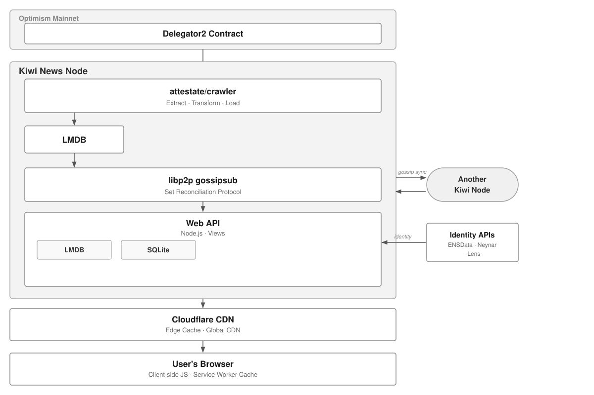

# Kiwi News

[](https://github.com/attestate/kiwistand/actions/workflows/node.js.yml)

This repository holds the code behind [Kiwi News](https://news.kiwistand.com), a community-curated news site for crypto, Ethereum and builder-focused tech links, similar to Hacker News.


Every submission, upvote and comment on Kiwi News is a message signed with an Ethereum key. Nodes exchange these messages over an open peer-to-peer protocol, so all data is public and anyone can verify it. Anyone can run a node or build their own client on top of the same data. The package and protocol are called "kiwistand"; the site is called "Kiwi News".

## Using Kiwi News

- Website: https://news.kiwistand.com ([new](https://news.kiwistand.com/new), [best](https://news.kiwistand.com/best), [guidelines](https://news.kiwistand.com/guidelines))
- iOS app (beta, via TestFlight): https://testflight.apple.com/join/6jyvYECH
- Newsletter: [Kiwi News Weekly](https://news.kiwistand.com/newsletter), a Sunday email with the week's most-upvoted stories ([past issues](https://buttondown.com/kiwi-news-weekly/archive/))
- Weekly archive: https://news.kiwistand.com/weekly
- RSS: [hot](https://news.kiwistand.com/feed.xml) and [new](https://news.kiwistand.com/new.xml)
- Telegram: [community chat](https://t.me/+QGAviVT67m00Njc8), [developer chat](https://t.me/kiwinewsdevs)
- X: [@KiwiNewsHQ](https://x.com/KiwiNewsHQ)

To post, upvote or comment you connect an Ethereum wallet. You can add an application key so the site signs on your behalf without a wallet prompt for every action (see [Protocol](#protocol)).

## Using the data

All read endpoints are public and need no authentication. CORS is open (`Access-Control-Allow-Origin: *`), so browser apps can call them directly.

- [`/llms.txt`](https://news.kiwistand.com/llms.txt): the main reference for developers and AI agents. It lists every endpoint, the response formats, how to cite Kiwi News, and how to sign and submit messages.
- `GET /api/v1/feeds/hot`, `/api/v1/feeds/new`, `/api/v1/feeds/best?period=week`: feeds as JSON (`?page=0` paginates)
- `GET /api/v1/stories?index=0x…`: one story with its comments
- `GET /api/v1/profile/<address>`: ENS name, avatar and social links of an address
- `GET /stories/context?index=0x…`: one story as plain-text Markdown (title, source URL, extracted article text, comments), meant as LLM context
- Writes go to the node API on port 8443 (`POST /api/v1/messages`, `POST /api/v1/list`, `GET /api/v1/delegations`); see llms.txt for the EIP-712 message format.

Example:

```bash
curl https://news.kiwistand.com/api/v1/feeds/hot
```

There is also an HTTP API reference at https://attestate.com/kiwistand/main/.

### MCP client

[`kiwimcp-client/`](kiwimcp-client/) is a Model Context Protocol server (published on npm as `kiwimcp-client`) that lets Claude Code and other MCP clients search Kiwi News, read feeds and stories with comments, and look up profiles and karma. Setup instructions are in [kiwimcp-client/README.md](kiwimcp-client/README.md).

## Running a node



### Requirements

- Node.js 22 (`engines` in package.json; CI runs on 22.x)
- An Optimism RPC endpoint. The node crawls delegation events from the delegation contract on Optimism. Free tiers can run into rate limits; you can spread the load across several providers (see `OPTIMISM_CRAWLER_RPC_HOSTS` below).
- An Ethereum mainnet RPC endpoint, used to resolve ENS names.

### Setup

```bash
git clone https://github.com/attestate/kiwistand.git
cd kiwistand
cp .env-copy .env
mkdir anon cache
npm i
cd src/web && npm i && cd ../..
```

Then edit `.env`. The variables you have to set:

| Variable | Purpose |
| --- | --- |
| `OPTIMISM_RPC_HTTP_HOST` | Optimism RPC URL (for example an Alchemy or Infura URL including your key) |
| `OPTIMISM_CRAWLER_RPC_HOSTS` | Optional: comma-separated Optimism RPCs for the delegation crawler. The first is polled for new blocks; `eth_getLogs` rotates through all of them. |
| `RPC_HTTP_HOST` | Ethereum mainnet RPC URL, for ENS |
| `DATA_DIR`, `CACHE_DIR` | Where the message database (LMDB) and caches (SQLite and others) live; `anon` and `cache` by default |

The other values in `.env-copy` work as they are for local development. The social posting variables (X, Farcaster, Telegram) and Cloudflare keys are only needed on the production instance.

### Scripts

The `dev:*` scripts and `watch` override some variables from `.env` to run the node in a particular mode, and start it together with the Vite dev server for `src/web`.

| Script | What it does |
| --- | --- |
| `npm run dev:anon` | Joins the live network: binds `0.0.0.0`, peers with the public bootstrap node, uses `DATA_DIR=anon`. Site on port 4000, node API on 8443. |
| `npm run watch` | Same settings as `dev:anon`, restarted by nodemon when `src/views` or `src/http.mjs` change. |
| `npm run dev:bootstrap` | Runs a local bootstrap node (`IS_BOOTSTRAP_NODE=true`, binds `127.0.0.1`, `DATA_DIR=bootstrap`) that does not connect to the live network. Site on port 80. |
| `npm run dev:anon:local` | Binds `127.0.0.1` and peers only with a local bootstrap node, so nothing reaches the live network. Uses `DATA_DIR=anonlocal`, site on port 4001. |
| `npm run sync` | Crawls the delegation events from Optimism into `DATA_DIR`. It keeps polling for new blocks; stop it once it repeats the same block range. |
| `npm run reconcile` | Syncs with the chain and the peer-to-peer network with the website disabled (`NODE_ENV=reconcile`). |
| `npm run build` | Builds the production frontend bundle into `src/public`. |

To try submitting stories, use `dev:bootstrap` together with `dev:anon:local` instead of the live network.

### Syncing a new node

1. `npm run sync` to crawl the delegation events from Optimism.
2. `npm run reconcile` to download all messages from peers. It logs `Number of messages added: X` as it stores messages.
3. `npm run dev:anon` (or `npm run watch`) to run the node with the website.

The first page loads of `/`, `/new` and `/best` after a full sync can be slow, because the node verifies and caches every message signature once.

[contributing.md](contributing.md) describes these steps in more detail.

### Tests

```bash
npm run test:offline   # what CI runs; skips tests that call the live site
npm test               # all tests, including the MCP client and compression tests against the live site
```

### Deployment

[`.github/workflows/deploy.yml`](.github/workflows/deploy.yml) runs the offline tests on every push to `main` and, when the `DEPLOY_ENABLED` repository variable is `"true"`, builds the frontend and rsyncs it to the production server, the same as `npm run deploy` does by hand.

## Protocol

- **Signed messages.** Stories, upvotes and comments are [EIP-712](https://eips.ethereum.org/EIPS/eip-712) typed messages signed by an Ethereum key. A node checks the signature and the timestamp before storing a message.
- **Identity and key delegation.** Any Ethereum address can sign messages for itself. An address can also authorize another key (for example an application key kept in the browser) through the delegation contract on Optimism; messages signed by that key are then attributed to the delegating address. The contract and SDK live in [attestate/delegator2](https://github.com/attestate/delegator2). Earlier versions required holding the Kiwi Pass NFT on Optimism to post; that requirement was removed in 0.12.0 (see [changelog.md](changelog.md)).
- **Set reconciliation.** Each node stores all messages in a Merkle Patricia trie. Nodes connect over [libp2p](https://libp2p.io), gossip new messages and their trie roots, and when two roots differ they compare the tries level by level to find and exchange the missing messages.
- **Versioning.** Breaking protocol changes bump the libp2p topic and protocol versions. Nodes on different versions do not sync, so all nodes need to upgrade together.

More detail:

- [Protocol guide](docs/source/protocol-guide.rst): how set reconciliation with a Merkle Patricia trie works, step by step (its NFT section predates 0.12.0)
- [Delegation](docs/source/delegation.rst): how application keys are authorized
- Talk: [Building decentralized social networks](https://www.youtube.com/watch?v=Rys5UEi2SWg) (Tim Daubenschütz at zusocial, Istanbul)
- Demos: [set reconciliation (40 s)](https://www.loom.com/share/abf43323b00547689bf11520f565f4bc), [algorithm explained (9 min)](https://www.loom.com/share/2a68f5e22d9843ab99edad2deaed9281)

## Contributing

- [contributing.md](contributing.md): setup and sync steps
- [CONVENTIONS.md](CONVENTIONS.md): code style and architecture conventions
- Issues and pull requests: https://github.com/attestate/kiwistand/issues

## Changelog

Protocol and breaking changes are listed in [changelog.md](changelog.md).

## License

GPL-3.0-only, see [LICENSE](LICENSE). The MCP client in `kiwimcp-client/` is MIT-licensed according to its package.json.

## Contact

- Developer chat on Telegram: https://t.me/kiwinewsdevs
- GitHub issues: https://github.com/attestate/kiwistand/issues
